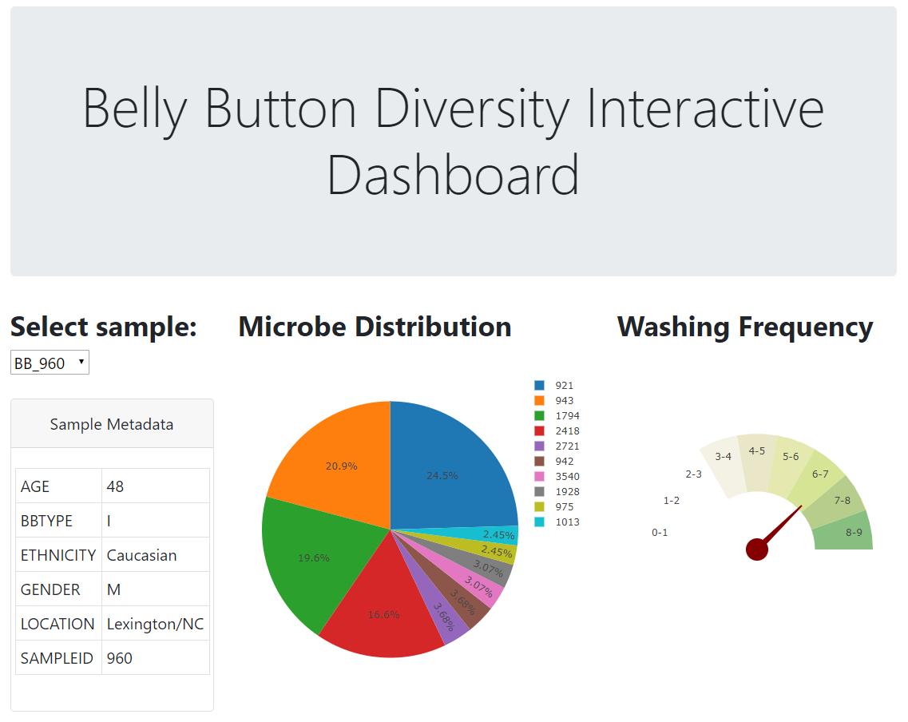

# belly-button
Belly Button Diversity: The creation of this interactive dashboard was inspired by a study conducted in January 2011 to invesigate the microbes inhabiting our navels and the factors that might influence the microscopic life calling this protected, moist patch of skin home.

## Webpage:
* https://bellybtn.herokuapp.com/

## Technology Stack
Python 
Flask framework 
Sqlite 
Javascript 
HTML/CSS/Bootstrap 

## Data Sources:
* http://robdunnlab.com/projects/belly-button-biodiversity/

## License
[MIT](LICENSE) © Justin Le
